# 基于STM32F407实现的蜂鸣器音乐盒

## 实验设计

在正式开始写实验前我就早早地开始构思，纵观这学期课程安排中学习的内容:

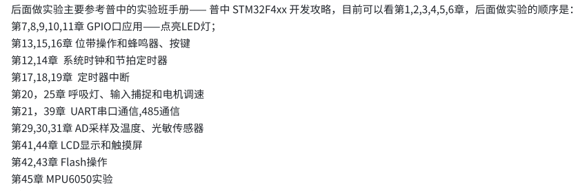

我想在最终的大作业中尽最大可能融会贯通，考虑到一定要有可视化UI，并且希望有一定趣味的表现形式，想到之前在大二上做数字电路实验大作业的时候曾写过FPGA的俄罗斯方块并且配以蜂鸣器音乐BGM，因此最终决定做一个基于STM32F407实现的蜂鸣器音乐盒。

实验开始前，我先列出预想要实现功能（预计顺序实现

- [x] 利用蜂鸣器播放音乐
- [x] 存储多个音乐（如果歌曲数量较多可以用FLASH存储）
- [x] 利用按键设备中断切换音乐 ⬅向前切换 ⬆重新播放 ⬇暂停 ➡向后切换
- [x] 利用电位器通过adc调整音量(模拟音量旋钮)
- [x] 利用显示屏输出当前音乐的封面、歌名、进度和音量
- [x] 通过串口输出当前歌曲信息
- [ ] <del>LED随音调律动</del>

至此，大作业涵盖了除了MPU6050、FLASH操作外的几乎所有内容。

> 最终我没能加入最后利用定时器中断输出PWM波控制LED灯律动的效果，因为这个和AD采样会出现复杂的bug并且导致宕机，由于时间有限所以我放弃加入这个功能了。

### 最终实现功能

基于板载外设和stm32f407单片机实现了蜂鸣器音乐盒，内含三首歌曲：《红尘情歌》、《荷塘月色》和《沉默是金》，同时支持用电位器旋钮调整音量，四个按钮分别对应四个不同的功能，左右两个按钮是左右切歌，上面的按钮用于重播，下面的按钮用于暂停和恢复播放。同时会通过板载显示器可视化的显示当前的歌曲专辑封面、歌名、进度和音量，并且会通过串口输出对应的内部程序运行信息（例如音调、节拍、adc采样值等）

### 程序执行流图

最终项目执行流程大概如下，省去了其中串口输出，屏幕显示，LED等相关内容。


> 实际上按键中断触发可能在循环的任何一个流程中，上述流图简化中断判断时刻了。

## 实验原理

我实现的大概功能和程序执行流程讲完了，接下来就是详细讲讲我每个功能是如何实现的了，我将我主要工作的内容分为以下这四个部分：

- 蜂鸣器播放音乐
- 按键中断控制
- ADC采样控制音量
- LCD屏幕显示

串口输出的部分大多都是复用了实验例程，没有什么实验难度，主要用于我自己在完成每个部分的过程中调试和debug用，因此不再赘述。

### 蜂鸣器播放音乐

#### 硬件设计

有源蜂鸣器内含振荡源，只要一通电就发声，但发生频率固定，音色单一；无源蜂鸣器内部不含振荡源，内部结构相当于电磁场扬声器，可以通过给他输出一定频率的信号才能发声。经过我的调查，网上的各种教程主要都是针对无源蜂鸣器，利用PWM波给予蜂鸣器一定频率的信号用来发声，这并不适用于我们这块板子。

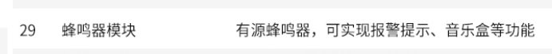

由于板载有源蜂鸣器会有震荡源的干扰，因此无法使用PWM波驱动，否则蜂鸣器发声会有很聒噪的杂音，只能采用IO根据频率翻转的方式。

我们 STM32 开发板上的蜂鸣器模块电路如下图所示：

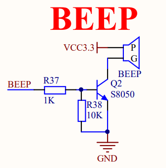

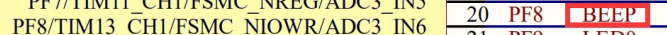

从电路图中可以看到，STM32 芯片的 PF8 引脚是用来控制蜂鸣器的，通过电阻 R37 和 NPN 三极管 Q2 进行电流放大，从而驱动蜂鸣器。电阻 R38 是一个下拉电阻，用来防止蜂鸣器误发声。当 PF8 引脚输出高电平时，三极管导通，蜂鸣器发声；当 PF8 引脚输出低电平时，三极管截止，蜂鸣器停止发声。

人耳能听到的频率范围在20Hz--20kHz之间，通过STM32的GPIO引脚快速切换高低电平输出就能实现有源蜂鸣器的发声，切换的频率不同，发出的音调就不一样。

#### 音调的频率

一段音乐就是不同频率的声音按一定的时间节拍转换发出。所以音乐包含音调和节拍信息。

C调各音符频率如下：

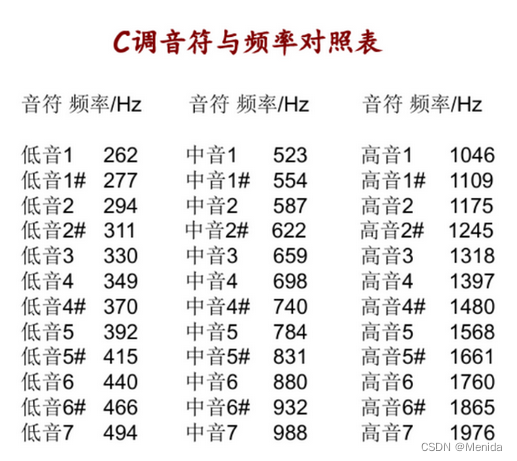

#### 时值的计算

[BPM](https://baike.baidu.com/item/BPM/2815203?fr=ge_ala)是Bat Per Minute的简称，中文名为拍子数，释义为每分钟节拍数的单位。最浅显的概念就是在一分钟的时间段落之间，所发出的声音节拍的数量，这个数量的单位便是BPM。这个与上面的定义的T有关。有的曲子会在谱子前面表明BPM，一般是100个全音符每分钟。

| 音符名称   | 写法           | 时值       |
| ---------- | -------------- | ---------- |
| 全音符     | 4­­­ – – –     | 四拍       |
| 二分音符   | 4 –            | 二拍       |
| 四分音符   | 4              | 一拍       |
| 八分音符   | $\underline 4$ | 半拍       |
| 十六分音符 | 以此类推       | 四分之一拍 |

我们以十六分音符为最小时间元，可以根据简谱写出每一个节拍对应的时间长度，一拍就是4，半拍就是2，以此类推。（如果存在附点就是当前音符的1.5倍时长）

#### 从歌曲简谱到数组表示

经过前面对音调和时值的介绍，下面来介绍我是如何通过简谱来将这首歌曲存储在beep.c中，以下面的红尘情歌为例：

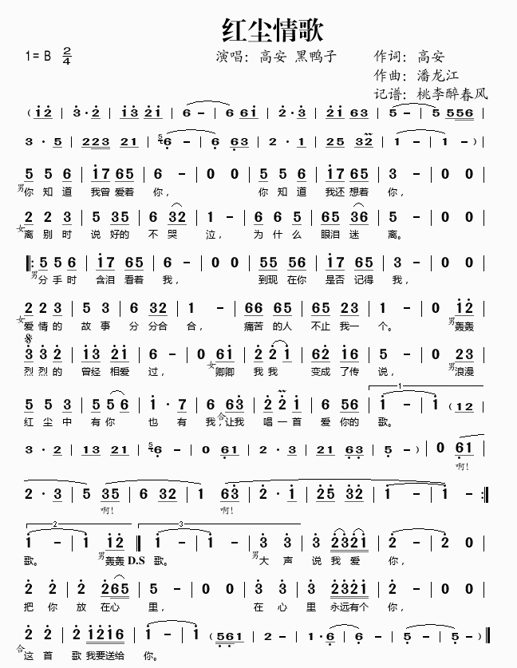

实验中简化音符频率，仅考虑一般的低中高三个声部，在beep.h中定义相关频率信息:

```cpp
// 定义低音频率
#define L1 262
#define L2 294
#define L3 330
#define L4 349
#define L5 392
#define L6 440
#define L7 494
// 定义中音
#define M1 523
#define M2 587
#define M3 659
#define M4 698
#define M5 784
#define M6 880
#define M7 988
// 定义高音
#define H1 1047
#define H2 1175
#define H3 1319
#define H4 1397
#define H5 1568
#define H6 1760
#define H7 1976
// 定义不发音
#define N 0
```

并在beep.c中声明全局变量音调数组tone[]:

```c
u16 tone[] = {N, L1, L2, L3, L4, L5, L6, L7, M1, M2, M3, M4, M5, M6, M7,  H1, H2, H3, H4, H5, H6, H7};
```

> 定义tone数组的好处是，可以通过只记录tone数组的下标来表示对应的音调，而不是直接记录音调频率，因为tone的下标范围是0~21, 这只需要用u8的大小就可以表示，而频率的范围是0\~2000，无法用u8表示(0\~255)，只能用u16数组来表示，而往往music_arr需要涵盖很多个音符，这样会导致空间开销很大，大大延长了程序烧录的时间，非常不利于debug和调试，因此改为下标存储简洁且高效。

通过对上述谱子进行转换可得到每一个音符对应的音调和时值如下

```c
//红尘情歌
u8 music_arr[]={5,5,6,8,7,6,5,6,0,0,//音调
                5,5,6,8,7,6,5,3,0,0,
                2,2,3,5,3,5,6,3,2,1,
                6,6,5,6,5,3,6,5,0,0,

                5,5,6,8,7,6,5,6,0,0,
                5,5,6,8,7,6,5,3,0,0,
                2,2,3,5,3,5,6,3,2,1,
                6,6,5,6,5,3,6,1,	

                0,8,9,10,10,9,8,10,9,8,6,
                0,6,8,9,9,8,6,9,8,6,5,
                0,2,3,5,5,3,5,5,6,8,7,6,
                6,10,9,9,8,6,5,6,8};	
u8 time_arr[] = {2,4,2,2,2,2,2,8,4, 4, //时间
                 2,4,2,2,2,2,2,8,4, 4, 
                 2,4,2,4,2,2,4,2,2,8,
                 2,4,2,2,2,2,2,8,4 ,4, 

                 2,4,2,2,2,2,2,8,4, 4, 
                 2,4,2,2,2,2,2,8,4, 4, 
                 2,4,2,4,2,2,4,2,2,8,
                 2,4,2,2,2,2,2,8,

                 4, 2,2,2, 4, 2,2,2, 2,2,8,
                 4, 2,2,2,4,2,2,2,2,2,8,
                 4, 2,2,2,4,2,2,5,2,6,2,4,
                 2,2 ,2,4,2,4,2,2,12};	
```

有了对应的音调和时值，就可以依次从音调数组中取music[i]，然后根据music[i]的值在tone数组中得到该音的发声频率(tone[music[i]])，调用sound函数控制蜂鸣器发声，声音的发声时间由time数组控制，最为核心的蜂鸣器发生循环就是这么简单两行代码就结束了（其中cur_num代表当前播放的歌曲，cur_tone代表当前播放的歌曲正在播放的音符）

```c
for(e=0;e<((u16)songs[cur_num].time[cur_tone])*tone[songs[cur_num].music[cur_tone]]/yanshi;e++){
    // 蜂鸣器发声
    Sound((u32)tone[songs[cur_num].music[cur_tone]]);
}
```

sound函数实现如下，通过传入音调的频率来控制蜂鸣器的IO翻转，在加入了音量变量后，通过改变周期来控制音调，通过改变周期内的占空比即可控制响度，

```c
void Sound(u16 frq)
{
    u32 time;
    if (frq != N)
    {
		if (volume != 0)
		{
			time = 500000 / ((u32)frq);
			BEEP = 1;
			delay_us(time * (float)(volume / 100.0));  // 根据音量调整高电平时间
			BEEP = 0;
			delay_us(time * (2-(float)(volume / 100.0)));  // 根据音量调整低电平时间
		}
		else
			delay_us(1000);
	}
	else
		delay_us(1000);
}
```

#### 加入多首歌曲

为了保证功能的展示，我再加入两首我比较喜爱的歌曲——《沉默是金》和《荷塘月色》，从网上扒来这两首歌的简谱之后，和之前的操作相同，得到这两首歌的音调和节拍数组：

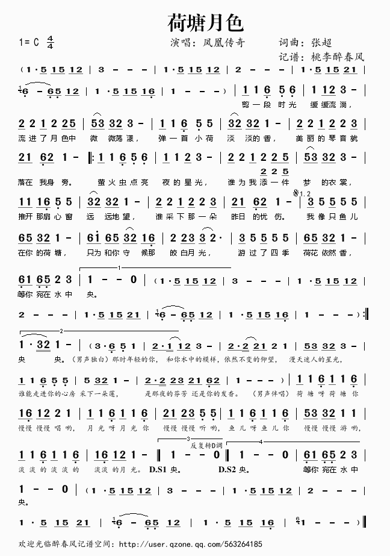

```c
//荷塘月色
u8 music_arr1[]={
    8,12,6,5,6,
    8,8,9,10,
    9,9,8,9,9,12,
    12,10,10,9,10,
    8,8,6,5,12,
    10,9,10,9,8,
    9,9,8,9,9,10,
    9,8,6,9,8,
    8,8,6,5,6,
    8,8,9,10,
    9,9,8,9,9,12,
    12,10,10,9,10,
    8,8,8,6,5,12,
    10,9,10,9,8,
    9,9,8,9,9,10,
    9,8,6,9,8,
    10,12,12,12,12,
    13,12,10,9,8,
    13,15,13,10,9,8,6,
    9,9,10,10,9,
    10,12,12,12,12,
    13,12,10,9,8,
    6,8,6,5,9,10,
    8,0
};

u8 time_arr1[]={
    2,4,2,4,4,
    4,2,2,8,
    2,4,2,4,2,2,
    2,2,2,2,8,
    2,4,2,4,4,
    2,2,2,2,8,
    2,4,2,2,4,2,
    2,2,2,2,8,
    2,4,2,4,4,
    2,4,2,8,
    2,4,2,4,2,2,
    2,2,2,2,8,
    2,2,2,2,4,4,
    2,2,2,2,8,
    2,4,2,2,4,2,
    2,2,2,2,8,
    2,4,2,4,4,
    2,2,2,2,8,
    2,2,2,2,2,2,2,2,
    4,2,2,2,6,
    2,4,2,4,4,
    2,2,2,2,8,
    2,2,2,2,4,4,
    12,4
};
```

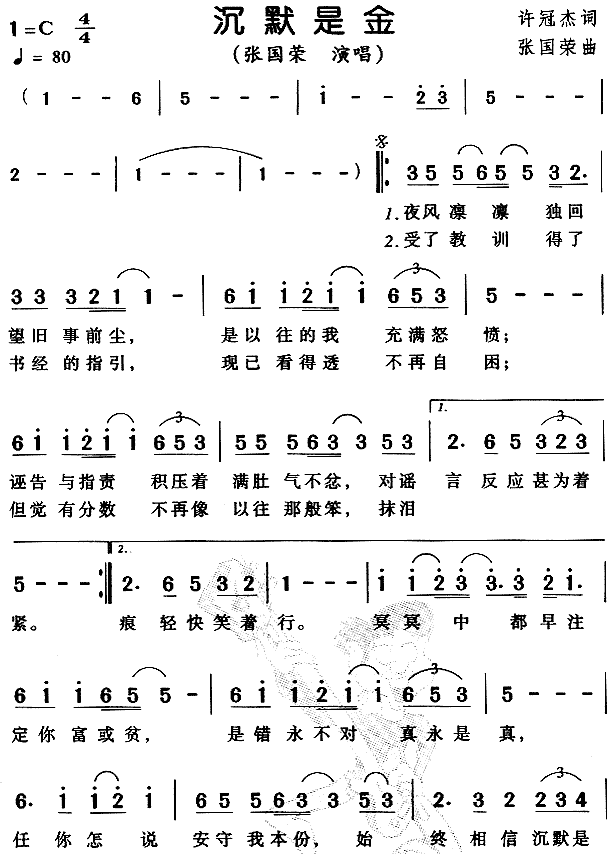

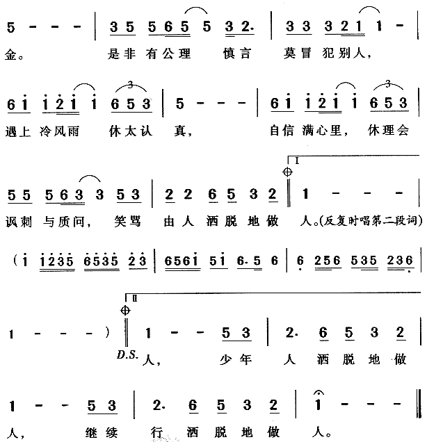

```c
// 沉默是金
u8 music_arr2[]={
    10,12,12,13,12,12,10,9,
    10,10,10,9,8,8,
    13,15,15,16,15,15,13,12,10,
    12,
    13,15,15,16,15,15,13,12,10,
    12,12,12,13,10,10,12,10,

    9,13,12,10,9,10,
    12,

    10,12,12,13,12,12,10,9,
    10,10,10,9,8,8,
    13,15,15,16,15,15,13,12,10,
    12,
    13,15,15,16,15,15,13,12,10,
    12,12,12,13,10,10,12,10,

    9,13,12,10,9,
    8,
    15,15,16,17,17,17,16,15,
    13,15,15,13,12,12,
    13,15,15,16,15,15,13,12,10,
    12,
    13,15,15,16,15,
    13,12,12,13,10,10,12,10,
    9,10,9,9,10,11,
    12,
    10,12,12,13,12,12,10,9,
    10,10,10,9,8,8,
    13,15,15,16,15,15,13,12,10,
    12,
    13,15,15,16,15,15,13,12,10,
    12,12,12,13,10,10,12,10,
    9,9,13,12,10,9,
    8
};
u8 time_arr2[]={
    2,2,2,1,1,4,1,3,
    2,2,2,1,1,8,
    2,2,2,1,1,4,2,2,2,
    16,
    2,2,2,1,1,4,2,2,2,
    2,2,2,1,1,4,2,2,

    6,2,4,2,2,2,
    16,

    2,2,2,1,1,4,1,3,
    2,2,2,1,1,8,
    2,2,2,1,1,4,2,2,2,
    16,
    2,2,2,1,1,4,2,2,2,
    2,2,2,1,1,4,2,2,

    6,2,4,2,2,
    16,
    4,2,1,1,3,1,1,3,
    2,2,2,1,1,8,
    2,2,2,1,1,4,2,2,2,
    16,
    6,2,2,2,4,
    2,2,2,1,1,4,2,2,
    6,2,4,2,2,2,
    16,
    2,2,2,1,1,4,1,3,
    2,2,2,1,1,8,
    2,2,2,1,1,4,2,2,2,
    16,
    2,2,2,1,1,4,2,2,2,
    2,2,2,1,1,4,2,2,
    2,4,2,2,4,2,
    16
};
```

为了方便多首歌的管理和操作，构建合适的结构体：

```c
// 定义歌曲结构体,重构下列代码，用L1代替247，用L2代替262，以此类推
typedef struct
{
    u8 music[300];
    u8 time[300];
    u8 length;
	char name[20];
} music_t;
music_t songs[3];
```

这里的songs即这三首歌，因此在播放音乐前需要初始化每首歌，将对应的音调和节拍数组赋给结构体内的数组，因此songs_init()函数应运而生：

```c
void songs_init()
{
	u8 i =0;
    strcpy(songs[0].name,"红尘情歌");
	strcpy(songs[1].name,"荷塘月色");
	strcpy(songs[2].name,"沉默是金");
	for(cur_num=0;cur_num<3;cur_num++)
	{
		printf("歌曲%d:%s初始化中...\r\n",cur_num,songs[cur_num].name);
		if (cur_num == 0)
		{
			for (i = 0; i < ARRAY_SIZE(music_arr); i++)
			{
				songs[0].music[i] = music_arr[i];
				songs[0].time[i] = time_arr[i];
			}
			songs[0].length = ARRAY_SIZE(music_arr);
		}
		else if (cur_num == 1)
		{
			songs[cur_num].length = ARRAY_SIZE(music_arr1);
			for(i=0;i<songs[cur_num].length;i++)
			{
				songs[cur_num].music[i] = music_arr1[i];
				songs[cur_num].time[i] = time_arr1[i];
			}
		}
		else if (cur_num == 2)
		{
			songs[cur_num].length = ARRAY_SIZE(music_arr2);
			for(i=0;i<songs[cur_num].length;i++)
			{
				songs[cur_num].music[i] = music_arr2[i];
				songs[cur_num].time[i] = time_arr2[i];
			}
		}
		printf("歌曲长度为：%d\r\n",songs[cur_num].length);
		printf("歌曲%d:%s初始化成功!\r\n",cur_num,songs[cur_num].name);
	}
	cur_num = 0;
}
```

通过串口输出相应信息来协助调试。

### 通过按键中断来控制音乐播放器

#### 硬件设计

STM32F4 外部中断/事件控制器（EXTI）包含多达 23 个用于产生事件/中断请求的边沿检测器。EXTI 的每根输入线都可单独进行配置，以选择类型（中断或事件）和相应的触发事件（上升沿触发、下降沿触发或边沿触发），还可独立地被屏蔽。EXTI框图如下：

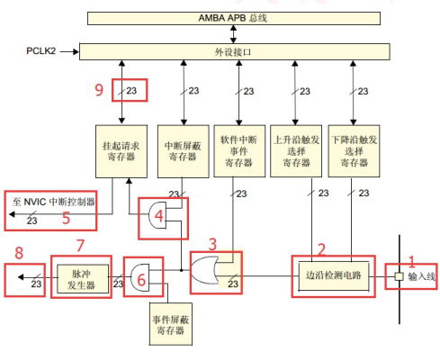

我们开发板上有 4 个控制按键，其硬件电路如下图所示

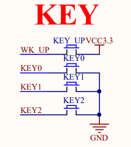

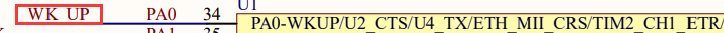

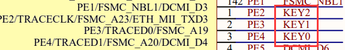

从原理图我们可以知道，按键 KEY_UP 连接在芯片的 PA0 引脚上，按键 KEY0、 KEY1、KEY2 分别连接在芯片的 PE4、PE3、PE2 引脚上。需要注意的是：KEY_UP 按键另一端是接在 3.3V 上，按下时输入到芯片管脚即为高电平；KEY0、KEY1、 KEY2 按键另一端是全部接在 GND 上，采用 独立式按键接法，按下时输入到芯片管脚即为低电平。

当按键按下时，对应的 IO 口电平会发声变化，这时只要配置好对应端口的 外部中断就可以触发中断。

#### 软件设计

由报告前述也可以看出，整个音乐播放器的核心其实就是一直在循环中跑sound函数，根据传入的音调和时值发声，但是该如何去实现暂停、切歌和重播等操作呢？在每个循环中分别扫描按键不是一个好的选择，因为在扫描按键的过程中会造成严重的发声停顿（scan_key用了多个delay函数），因此顺理成章地想到利用按键中断，通过中断服务函数调用beep.c中的控制函数，修改全局控制变量，如pause_play,restart等值，就可以轻易地在循环中判断这些控制信号来实现对应的功能。

因此我复用了实验例程10-外部中断实验的代码，将每个按键key触发的中断服务函数修改为beep对应的控制函数:

```c
void EXTI0_IRQHandler(void)
{
	if(EXTI_GetITStatus(EXTI_Line0)==1)
	{
		delay_ms(10);
		if(KEY_UP==1)
		{
			replay();
		}	
	}
	EXTI_ClearITPendingBit(EXTI_Line0);
}

void EXTI2_IRQHandler(void)
{
	if(EXTI_GetITStatus(EXTI_Line2)==1)
	{
		delay_ms(10);
		if(KEY2==0)
		{	
			turn_left();
		}
		
	}
	EXTI_ClearITPendingBit(EXTI_Line2);
}

void EXTI3_IRQHandler(void)
{
	if(EXTI_GetITStatus(EXTI_Line3)==1)
	{
		delay_ms(10);
		if(KEY1==0)
		{	
			pause();
		}
		
	}
	EXTI_ClearITPendingBit(EXTI_Line3);
}

void EXTI4_IRQHandler(void)
{
	if(EXTI_GetITStatus(EXTI_Line4)==1)
	{
		delay_ms(10);
		if(KEY0==0)
		{
			turn_right();
		}
		
	}
	EXTI_ClearITPendingBit(EXTI_Line4);
}
```

而具体的控制函数在beep.c中实现，用于改变全局控制变量，代码相当easy，但有效！

```c
u8 pause_play=0;
u8 cur_num;
u16 cur_tone;

void pause(void)
{
	pause_play=!pause_play;
}

void turn_left(void)
{
	if (cur_num == 0)
		cur_num = 2;
	else
		cur_num--;
	cur_tone = 0;
}
void turn_right(void)
{
	if (cur_num == 2)
		cur_num = 0;
	else
		cur_num++;
	cur_tone = 0;
}

void replay(void)
{
	cur_tone = 0;
}
```

### 利用ADC采样电位器电压调节音量

#### 硬件设计

ADC（analog to digital converter）即模数转换器，它可以将模拟信号转换为数字信号。按照其转换原理主要分为逐次逼近型、双积分型、电压频率转换型三种。STM32F4 的 ADC 就是逐次逼近型的模拟数字转换器

STM32 的 ADC 的输入通道多达 19 个，其中外部的 16 个通道就是框图中的ADCx_IN0、ADCx_IN1...ADCx_IN5（x=1/2/3，表示 ADC 数），通过这 16 个外部通道可以采集模拟信号。

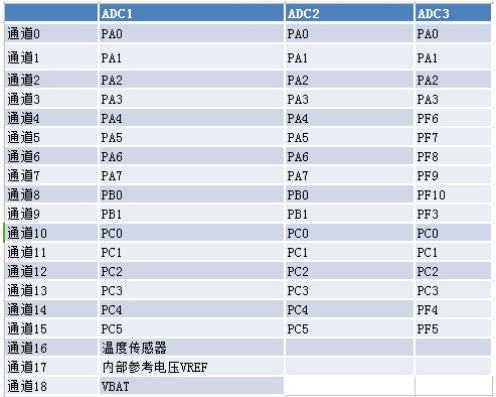

使用短接片可以将 STM_ADC（PA5）连接在电位器（R_ADC）上，调节电位器即可改变电压，通过 ADC 转换即可检测 此电压值。电路如下图所示

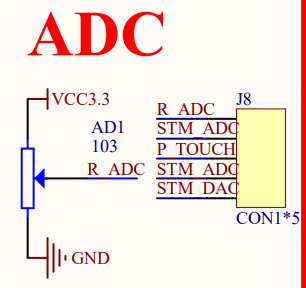

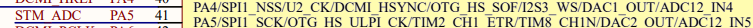

#### 软件设计

在构思4个按钮的控制之后，开始思考如何调节音量，这需要额外的外设来控制。通过板子上的电位器，联想到音响上的音量旋钮，我只需要一个ADC转换就可以将采样值映射到音量，这样就实现了直观的音量控制了。

通过 ADC1 通道 5 采样外部电压值，将采样的 AD 值转化为对应的音量值，通过串口输出并更新音量条。

```c
adc_value = Get_ADC_Value(ADC_Channel_5,10);
last_volume = volume;
volume = (float)adc_value/4096 * 100;
printf("adc_value=%d, volume=%d\r\n",adc_value,volume);
// 更新音量条, 消除adc抖动，考虑+-2以内的抖动
if (volume > last_volume+2 || volume < last_volume-2)
{
    // 先清空音量条
    LCD_Fill(11, 446, 309, 454, WHITE);
    // 再填充音量条
    LCD_Fill(11, 446, 11+volume*298/100, 454, GREEN);
}
```

将 AD 转换值 adc_value/4096 * 100转换为音量，因为我们使用的 ADC1 为 12 位转换精度，最大值为 2^12 即 4096， 而设计音量最大值为100，所以知道 AD 转换值就可以通过这行代码映射到音量。

其中由于AD的采样存在抖动，需要对音量+-2以内的情况做出一些调整，避免频繁更新音量显示条出现闪屏或者没有调节音量的时候发现音量在上下波动。

### 通过TFT-LCD屏幕绘制播放器UI

#### 硬件设计

板子上最显眼的部分莫过于这块TFTLCD显示板了，电路如下：

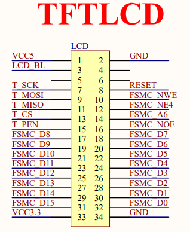

实际上其驱动已经打包好了，不需要了解太多关于底层的内容，直接用封装好的函数就可以在其上面显示想要的内容。

#### 软件设计

下面是播放器的主体代码：可以看到大部分代码都是在绘制显示屏上的相关内容：

```c
// 歌曲信息显示部分 LCD屏幕分辨率320*480
LCD_Clear(WHITE);
LCD_ShowString(80,10,tftlcd_data.width,tftlcd_data.height,16,"STM32F407 Music Player");
LCD_ShowString(200,30,tftlcd_data.width,tftlcd_data.height,12,"By AmberHeart");
LCD_ShowFontHZ(10,60, "正在播放");
// 绘制进度条外框，在播放循环中更新进度条
LCD_ShowFontHZ(10,350, "进度");
LCD_DrawRectangle(10, 385, 310, 405);
LCD_Fill(11, 386, 309, 404, WHITE);
// 绘制音量条外框
LCD_ShowFontHZ(10,410, "音量");
LCD_DrawRectangle(10, 445, 310, 455);
while(1)
{
    last_num = cur_num;
    if (cur_num == 0){
        LCD_ShowFontHZ(100,90, "红尘情歌");
        LCD_ShowPicture(65, 140, 191, 191, (u8 *)gImage_hongchenqingge);
        delay_ms(300);
    }
    else if (cur_num == 1){
        LCD_ShowFontHZ(100,90, "荷塘月色");
        LCD_ShowPicture(65, 140, 191, 192, (u8 *)gImage_hetangyuese);
        delay_ms(300);
    }
    else if (cur_num == 2){
        LCD_ShowFontHZ(100,90, "沉默是金");
        LCD_ShowPicture(65, 140, 193, 192, (u8 *)gImage_chenmoshijin);
        delay_ms(300);
    }
    LCD_Fill(11, 446, 11+volume*298/100, 454, GREEN);
    // 播放歌曲部分
    for(cur_tone=0;cur_tone<songs[cur_num].length;cur_tone++)
    {	
        // 更新歌曲信息
        if (cur_num != last_num)
        {
            if (cur_num == 0){
                LCD_ShowFontHZ(100,90, "红尘情歌");
                LCD_ShowPicture(65, 140, 191, 191, (u8 *)gImage_hongchenqingge);
                delay_ms(300);
            }
            else if (cur_num == 1){
                LCD_ShowFontHZ(100,90, "荷塘月色");
                LCD_ShowPicture(65, 140, 191, 192, (u8 *)gImage_hetangyuese);
                delay_ms(300);
            }
            else if (cur_num == 2){
                LCD_ShowFontHZ(100,90, "沉默是金");
                LCD_ShowPicture(65, 140, 193, 192, (u8 *)gImage_chenmoshijin);
                delay_ms(300);
            }
            last_num = cur_num;
        }
        // 更新进度条
        if (cur_tone <= 1){
            // 先清空进度条
            LCD_Fill(11, 386, 309, 404, WHITE);
            // 再填充进度条
            LCD_Fill(11, 386, 11+cur_tone*298/songs[cur_num].length, 404, BLUE);
        }
        else
            // 填充进度条
            LCD_Fill(11, 386, 11+cur_tone*298/songs[cur_num].length, 404, BLUE);
        // 暂停处理
        while(pause_play)
        {
            LED1=0;
            LED2=1; // 红灯常量
            // 暂停的时候也要更新音量条
            adc_value = Get_ADC_Value(ADC_Channel_5,10);
            last_volume = volume;
            volume = (float)adc_value/4096 * 100;
            // 更新音量条, 消除adc抖动，考虑+-3以内的抖动
            if (volume > last_volume+2 || volume < last_volume-2)
            {
                // 先清空音量条
                LCD_Fill(11, 446, 309, 454, WHITE);
                // 再填充音量条
                LCD_Fill(11, 446, 11+volume*298/100, 454, GREEN);
            }
        }
        LED2=0;
        LED1=1;
        // printf("cur")
        // 读取ADC值，计算音量
        adc_value = Get_ADC_Value(ADC_Channel_5,10);
        last_volume = volume;
        volume = (float)adc_value/4096 * 100;
        printf("adc_value=%d, volume=%d\r\n",adc_value,volume);
        // 更新音量条, 消除adc抖动，考虑+-3以内的抖动
        if (volume > last_volume+2 || volume < last_volume-2)
        {
            // 先清空音量条
            LCD_Fill(11, 446, 309, 454, WHITE);
            // 再填充音量条
            LCD_Fill(11, 446, 11+volume*298/100, 454, GREEN);
        }

        printf("cur_tone=%d, cur_num=%d, music=%d, time=%d\r\n",cur_tone,cur_num,songs[cur_num].music[cur_tone],songs[cur_num].time[cur_tone]);
        for(e=0;e<((u16)songs[cur_num].time[cur_tone])*tone[songs[cur_num].music[cur_tone]]/yanshi;e++){
            // 蜂鸣器发声
            Sound((u32)tone[songs[cur_num].music[cur_tone]]);
        }
        // last_tone = cur_tone;
    }
    turn_right();
}
```

为了能够支持显示汉字，利用取字模软件.exe得到每个需要显示的汉字的32*29显示数组，同时利用Img2Lcd.exe将需要显示的专辑封面转变成16真彩色数组保存在对应的.h文件中即可实现这些图片的显示，三首歌曲专辑封面如下（图源网易云音乐）

红尘情歌：


沉默是金：


荷塘月色：


最后就是进度条和音量条的设计，通过cur_tone和歌曲长度的比较、volume和音量上限100的比较，在框中填充对应长度的颜色来表现出可视化ui的感觉。

## 实验结果

上板效果如图：

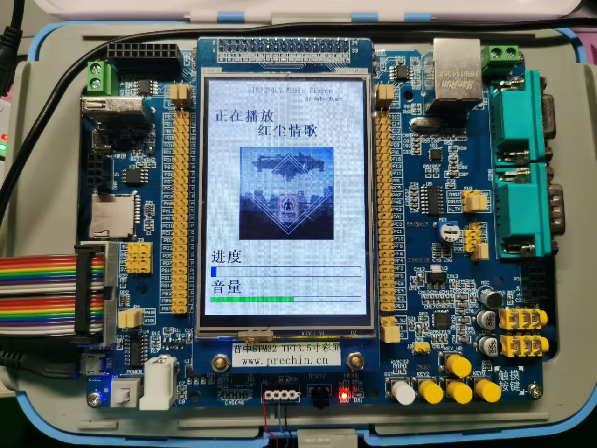

